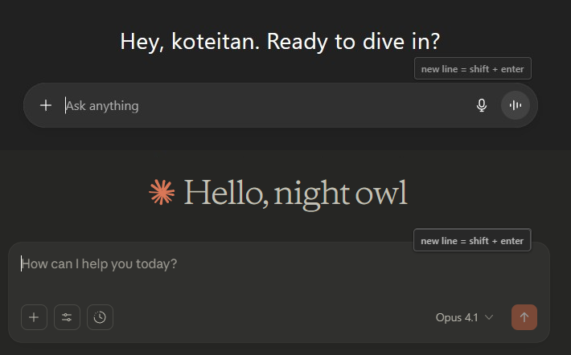
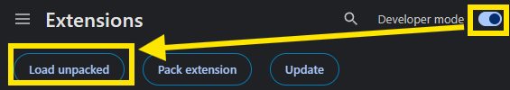

# New Line Guide

A Chrome extension that displays a helpful guide "new line = shift + enter" above text input areas on ChatGPT and Claude websites.

## 1. How to Install

### Install as an unpacked extension

1. Open Chrome and navigate to `chrome://extensions/`
2. Enable **Developer mode** (toggle switch in the top right corner) and click **Load unpacked** button
3. Select the directory containing this extension
4. The extension will be loaded and activated

## 2. Specification

This extension works on ChatGPT (chatgpt.com) and Claude (claude.ai) with different positioning strategies for each site.

### ChatGPT
- Checks if `window.location.hostname === 'chatgpt.com'` (matched by manifest.json: `https://chatgpt.com/*`)
- Searches for input elements:
  - `<textarea>` elements
  - Elements with `contenteditable="true"`
- Finds the best parent container:
  1. Starts with the input element's immediate parent
  2. Traverses up the DOM tree, checking each parent (up to 8 levels)
  3. For each parent, checks if it has:
     - `overflow: visible` (all of `overflow`, `overflowX`, `overflowY` must be `visible`)
     - AND `position: relative` or `position: absolute`
  4. If a parent meets both conditions, selects it as the container
  5. If no suitable parent is found after 8 levels, uses the immediate parent
  6. If the selected container has `position: static`, changes it to `position: relative`
- Appends the guide to the selected container
- Positions the guide with `position: absolute`, `top: -32px`, `right: 8px`

### Claude
- Checks if `window.location.hostname === 'claude.ai'` (matched by manifest.json: `https://claude.ai/*`)
- Searches for input elements:
  - `<textarea>` elements
  - Elements with `contenteditable="true"`
- Uses `position: fixed` to escape the parent's z-index stacking context
- Calculates position dynamically using `getBoundingClientRect()`:
  - `top = element.top - 32px`
  - `right = window.innerWidth - element.right + 8px`
- Appends the guide to `document.body`
- Updates position on:
  - Scroll events (with capture phase)
  - Resize events
  - Every 500ms interval
- Automatically removes the guide if the input element is removed from DOM

### Common behavior
- Only processes visible elements with:
  - Width > 100px
  - Height > 20px
  - Not hidden (`display` ≠ `none`, `visibility` ≠ `hidden`)
  - Has offsetParent (not absolutely positioned with no positioned ancestor)
- Uses MutationObserver to detect dynamically added input elements
- Uses IntersectionObserver to detect when elements become visible
- Re-processes on focus events for dynamically shown elements
- Retries processing at 1s, 2s, 3s, and 5s after page load (for SPAs)

## License

[MIT License](LICENSE)
